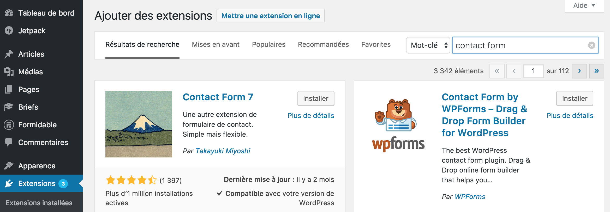
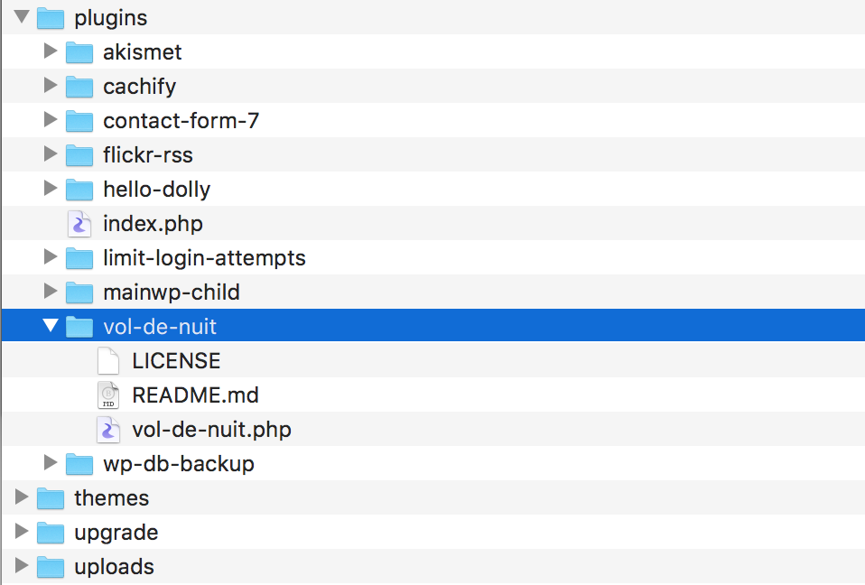

On a vu qu'un **thème enfant** est utile pour modifier l'apparence d'un thème, et lui apporter des personnalisations.

De manière similaire, on peut souhaiter apporter de petites fonctionalités, qui ne sont pas forcément liées à un thème. Elle peuvent être intégrées sous forme d'extension. 

Tout comme un thème enfant, une **extension WordPress** peut être composée d'un simple fichier PHP contenant une seule ligne de code.

Voici un exemple d'extension simpliste: [Vol de Nuit](https://github.com/collectifwp/vol-de-nuit/)

Le code de ce plugin est le suivant:

```php
add_filter( 'jetpack_development_mode', '__return_true' );
```

C'est littéralement une seule ligne de code! Cette ligne a pour effet d'intervenir sur le chargement de l'extension Jetpack, et de modifier son fonctionnement. 

Pour que ce code soit considéré par WordPress comme une extension valide, il faut que le fichier PHP comprenne un en-tête, permettant de l'identifier comme tel. Voici le code complet du plugin:

```
<?php
/*
Plugin Name: Vol de nuit
Plugin URI: https://github.com/collectifwp/vol-de-nuit
Description: Plugin de fonctionalité pour mettre Jetpack en mode Dev.
Version: 0.1
Author: Collectif WP
Author URI: https://github.com/collectifwp/
*/
// Infos: https://jetpack.com/support/development-mode/
add_filter( 'jetpack_development_mode', '__return_true' );
```

## Activer l'extension

Nous avons donc le code de l'extension - mais comment l'activer?

Il y a trois manières d'installer et d'activer une extension dans WordPress:

1. En l'installant depuis le répertoire WordPress.org via l'interface d'administration de votre site.
2. En uploadant un fichier ZIP dans l'espace d'administration.
3. En le déposant dans le dossier wp-content/plugins via un client FTP.

Voici le détail de ces trois opérations:

### 1 : Installer depuis WordPress.org


- Dans l'espace d'administration de votre site, allez sous *Extensions*. 
- Cliquez sur *Ajouter*.
- Cherchez l'extension souhaitée via le champ de recherche. Si p.ex. vous cherchez une extension pour ajouter un formulaire de contact, entrez "contact form". Une recherche sera effectuée parmi les quelque 50'000 extensions publiées sur WordPress.org.
- Une fois que vous trouvez l'extension souhaitée, vous pouvez cliquer sur "Installer".



Cette méthode ne permet pas d'activer une extension que vous auriez développé vous-même, ou provenant d'une source autre que WordPress.org (p.ex. publiée sur Github, comme c'est le cas pour *Vol de Nuit*). Si vous êtes dans ce cas, utilisez une des deux méthodes suivantes...

### 2 : Uploader un ZIP via l'espace admin

Dans ce cas de figure, vous vous êtes procuré le fichier du plugin que vous souhaitez installer. Vous l'aurez obtenu sous forme de **fichier ZIP**. Si l'extension se présente sous forme de dossier contenant des fichiers php (p.ex. parce que Safari l'a automatiquement décompressée suite au téléchargement), vous pouvez la re-transformer en ZIP en faisant "Ctrl-click > Compresser".

Dans le cas de [Vol de Nuit](https://github.com/collectifwp/vol-de-nuit/), vous pouvez télécharger l'extension depuis GitHub en cliquant "Clone or download", puis "Download ZIP". 


Une fois que vous avez le ZIP, suivez cette procédure:

- Dans l'espace d'administration de votre site, allez sous *Extensions*. 
- Cliquez sur *Ajouter*.
- Cliquez sur *Mettre une extension en ligne*
- Cliquez sur "Choisissez un fichier" (ou "Choose File"), et sélectionnez votre ZIP.
- Cliquez sur installer.
- Si par votre ZIP n'est pas une extension valide, vous verrez un message disant "L’archive n’a pas pu être installée. Aucune extension valide trouvée".
- Si votre extension est valide, vous verrez un message disant "L’extension a bien été installée", et un bouton "Activer l'extension". Cliquez-le...

Ça y est, vous avez activé votre extension!

### 3 : Uploader via un client FTP

Dans la mesure où vous connaissez les codes d'accès FTP à votre espace web, vous pouvez [utiliser un client FTP](https://cours-web.ch/outils/ftp/) pour mettre votre extension en ligne.

* Ouvrez une connexion FTP.
* Naviguez dans les fichiers de votre site WordPress, dans le dossier "/wp-content/plugins".
* Vous verrez les dossiers des extensions installées.
* Vous pouvez ajouter le dossier de votre extension - attention, pas le ZIP, mais le dossier décompressé!



Une fois que c'est fait, vous pouvez retourner dans l'espace d'administration de votre site. Si vous avez correctement fait l'opération, en allant sous Extensions, vous verrez que l'extension mise en ligne par FTP est installée. Il ne vous reste plus qu'à cliquer "Activer".

Voilà, vous connaissez maintenant trois manières d'installer une extension WordPress!

En bonus, voici un autre exemple d'extension simple et facile à modifier: [WP Eracom Colorize](https://github.com/eracom/wp-eracom-colorize/). Il s'agit d'une extension qui a pour but de modifier les couleurs de votre site en fonction des saisons, ou d'une date particulière. 

## Bien nommer vos extensions

**Bon à savoir:** étant donné que WordPress propose automatiquement des mises à jour pour tous les thèmes ou extensions chargés depuis WordPress.org, il est important d'éviter des **conflits de nom** avec des thèmes ou extensions publiés sur ce site. La manière dont WordPress les identifie prend en compte différents facteurs, dont le **nom du dossier**, le "Plugin Name" indiqué dans l'en-tête, et le descriptif. 

Si vous créez votre propre thème ou extension, veillez donc à ce que le "Plugin Name" et le nom de dossier soient suffisamment "uniques" pour ne pas risquer un conflit (ce qui pourrait conduire votre extension à être remplacée par une autre lors d'une mise à jour).

Dans l'exemple ci-dessus, on aurait pu nommer l'extension "wp-colorize"... mais les chances sont grandes qu'une extension avec un nom similaire existe déjà, ou voie le jour dans le futur! Il est plus prudent de lui donner un identifiant plus personnalisé, en le nommant p.ex. "wp-eracom-colorize".

Plus d'infos à ce sujet:

* [Un ticket datant de 2015](https://core.trac.wordpress.org/ticket/32101)
* [Une discussion](https://wordpress.stackexchange.com/questions/120462/how-to-avoid-plugin-name-conflicts-from-the-upgrade-notifier) sur StackExchange
* [Une autre discussion](https://wordpress.stackexchange.com/questions/168382/avoiding-plugin-name-collisions-with-wp-updater) sur StackExchange
